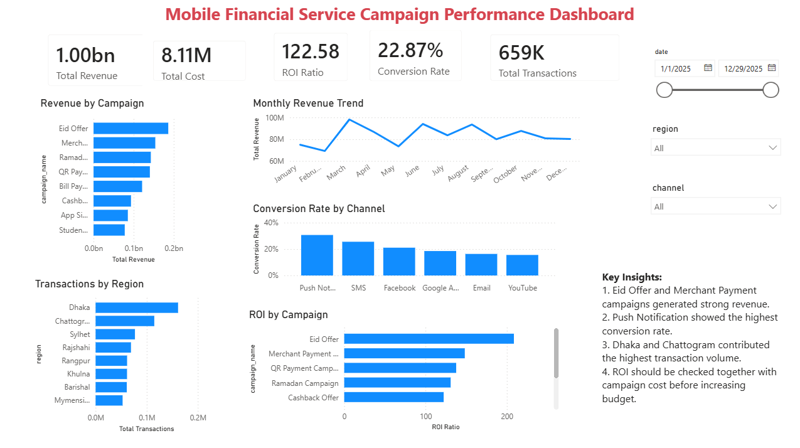

# Mobile Financial Service Campaign Performance Dashboard

## Project Overview

This is a Power BI dashboard project focused on analyzing campaign performance for a simulated Mobile Financial Service (MFS) business scenario.

The goal of this project is to show how raw campaign data can be transformed into useful business insights through Power BI, Power Query, DAX measures, and interactive dashboard design.

This dashboard helps analyze campaign revenue, campaign cost, ROI ratio, conversion rate, transaction volume, regional performance, channel performance, and monthly revenue trends.

---

## Dashboard Preview



---

## Tools Used

- Power BI Desktop
- Power Query
- DAX
- CSV dataset
- Data visualization
- KPI reporting

---

## Dataset Description

The dataset used in this project is a simulated Mobile Financial Service campaign dataset. It does not contain any real customer, company, or transaction data.

The dataset includes campaign-level and transaction-related fields that are commonly useful for marketing and business performance analysis.

### Main Columns

| Column Name | Description |
|---|---|
| `date` | Campaign activity date |
| `campaign_name` | Name of the marketing campaign |
| `channel` | Marketing channel such as SMS, Facebook, Google Ads, Email, Push Notification, and YouTube |
| `region` | Business region such as Dhaka, Chattogram, Sylhet, Rajshahi, Khulna, Barishal, Rangpur, and Mymensingh |
| `impressions` | Number of times campaign content was shown |
| `clicks` | Number of users who clicked the campaign |
| `signups` | Number of users who signed up from the campaign |
| `transactions` | Number of transactions generated |
| `transaction_amount` | Total transaction value generated |
| `campaign_cost` | Cost spent on the campaign |
| `active_users` | Number of active users in the segment/region |
| `payment_type` | Type of payment activity |
| `customer_segment` | Customer group or segment |

---

## Key KPIs

The dashboard includes the following KPI cards:

- Total Revenue
- Total Cost
- ROI Ratio
- Conversion Rate
- Total Transactions

These KPIs help provide a quick summary of overall campaign performance.

---

## Dashboard Features

### 1. KPI Summary Cards
The top section of the dashboard shows high-level campaign performance metrics, including total revenue, total campaign cost, ROI ratio, conversion rate, and total transactions.

### 2. Revenue by Campaign
This chart compares total revenue generated by each campaign. It helps identify which campaigns contributed the most to business revenue.

### 3. Monthly Revenue Trend
This line chart shows revenue performance across months. It helps identify seasonality, growth patterns, and revenue fluctuations over time.

### 4. Conversion Rate by Channel
This chart compares conversion rate across different marketing channels. It helps identify which channels are more effective in converting users.

### 5. Transactions by Region
This chart shows transaction volume by region. It helps identify high-performing regions and areas with lower transaction activity.

### 6. ROI by Campaign
This chart compares campaign ROI ratio. It helps evaluate whether high-revenue campaigns are also cost-efficient.

### 7. Interactive Slicers
The dashboard includes slicers for:
- Date
- Region
- Channel

These slicers allow users to filter the dashboard and explore campaign performance from different perspectives.

---

## DAX Measures Used

Some of the main DAX measures created in this project include:

```DAX
Total Revenue = SUM(mfs_campaign_data[transaction_amount])

Total Cost = SUM(mfs_campaign_data[campaign_cost])

Total Transactions = SUM(mfs_campaign_data[transactions])

Total Signups = SUM(mfs_campaign_data[signups])

Total Clicks = SUM(mfs_campaign_data[clicks])

Total Impressions = SUM(mfs_campaign_data[impressions])

CTR = DIVIDE([Total Clicks], [Total Impressions])

Conversion Rate = DIVIDE([Total Signups], [Total Clicks])

ROI = DIVIDE([Total Revenue] - [Total Cost], [Total Cost])

Average Transaction Value = DIVIDE([Total Revenue], [Total Transactions])
```

---

## Key Insights

Based on the dashboard analysis:

1. Eid Offer and Merchant Payment campaigns generated strong revenue.
2. Push Notification showed the highest conversion rate.
3. Dhaka and Chattogram contributed the highest transaction volume.
4. ROI should be checked together with campaign cost before increasing campaign budget.
5. Campaigns with strong revenue are not always the most cost-efficient, so both revenue and ROI should be considered before making marketing decisions.

---

## What I Did in This Project

In this project, I:

- Imported a CSV dataset into Power BI
- Checked and prepared data using Power Query
- Verified data types such as date, text, whole number, and decimal number
- Created DAX measures for business KPIs
- Designed KPI cards for quick performance tracking
- Built charts for campaign, channel, regional, and monthly analysis
- Added slicers for interactive filtering
- Created a clean dashboard layout suitable for business users
- Summarized key insights from the dashboard

---

## Project Files

| File/Folder | Description |
|---|---|
| `mfs_campaign_dashboard.pbix` | Main Power BI dashboard file |
| `data/mfs_campaign_data.csv` | Simulated dataset used in the dashboard |
| `data/data_dictionary.csv` | Description of dataset columns |
| `powerbi/dax_measures.txt` | List of DAX measures used in the dashboard |
| `powerbi/power_query_cleaning_steps.txt` | Power Query preparation notes |
| `screenshots/dashboard.png` | Dashboard preview image |

---

## How to Open This Project

1. Download or clone this repository.
2. Open `mfs_campaign_dashboard.pbix` using Power BI Desktop.
3. If Power BI asks for the data source path, reconnect it to `data/mfs_campaign_data.csv`.
4. Explore the dashboard using the Date, Region, and Channel slicers.

---

## Purpose of This Project

This project was created as a Data Analyst portfolio project to demonstrate practical Power BI skills, including data preparation, KPI creation, dashboard design, DAX measure creation, and business insight presentation.

It shows how campaign data can be converted into a clear and interactive dashboard that supports data-driven decision-making.

